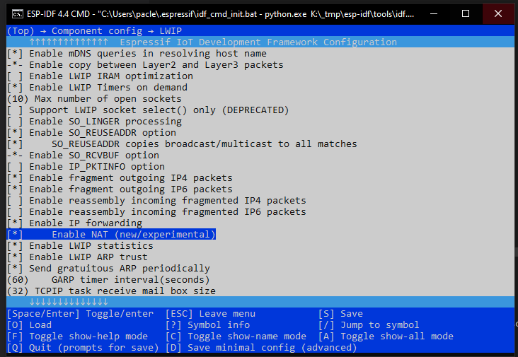

I try to add esp32 nat features to arduino-esp32 framework based on this esp-idf nat example for esp32: https://github.com/jonask1337/esp-idf-nat-example

As those features are not fully enabled on arduino-esp32 compiled sdk. I have to recompile it enabling those features.
For that porpouse I have to install esp-idf in order to use `idf.py menuconfig` (before used make menuconfig) to select the specific sdk.

To recompile esp-idf I have found useful the next comments:
* https://github.com/espressif/arduino-esp32/issues/1142#issuecomment-367867856
* https://github.com/espressif/arduino-esp32/issues/1142#issuecomment-512428852
* https://github.com/espressif/arduino-esp32/blob/master/docs/esp-idf_component.md

However, I have discovered that espressif provides some tools within [esp32-arduino-lib-builder](https://github.com/espressif/arduino-esp32/blob/master/docs/lib_builder.md) to help to recompile it for arduino-esp32 framework. And since the nat feature seems to be available already [here](https://github.com/espressif/arduino-esp32/blob/master/tools/sdk/esp32/include/lwip/lwip/src/include/lwip/lwip_napt.h) and I just need to recompile sep-if to enable those features.

So I have directly cloned on my rpi 2 the [esp32-arduino-lib-builder](https://github.com/espressif/esp32-arduino-lib-builder) and run the build.sh script.
After I could re-conpile the sdk, I have modify the sdkconfig.esp32 file to add the LWIP ip forward and NAT featues using idf.py menuconfig and re-compile it again:



It will be exported under esp32-arduino-lib-builder/dist a .gz file containning the libs that it should be placed under framework-arduinoespressif32 folder that you can find under `C:\Users\<your-user>\.platformio\packages\` 

I have created a fork to arduino-esp32 repo containing this compiled lib, so It can be used from platformio.ini instead copiying manually with (TO BE CONFIGURED...):

```ini
platform_packages =
  framework-arduinoespressif32 @ https://github.com/paclema/arduino-esp32#lwip_enabled
...
```

To compile it correctly, you will need to replace the `C:\Users\<your-user>\.platformio\packages\toolchain-xtensa32\` with the content of this version:
https://dl.espressif.com/github_assets/espressif/crosstool-NG/releases/download/esp-2020r3/
